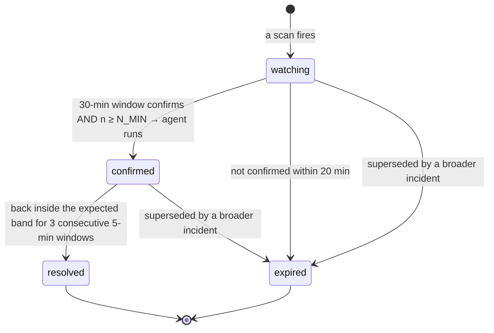

# ARCHITECTURE.md — Control Tower

> Keep this file true, not aspirational. Update it when the architecture actually changes.
> Last reconciled with the code after the first build. Deviations from the original plan
> are marked **[changed]** with the reason.

## System diagram

```mermaid
flowchart LR
  subgraph Sim["Simulation (mock)"]
    CLK[Sim clock<br/>60 simulated min per real sec]
    GEN[Counter generator<br/>seasonal baseline]
    INJ[Injection form<br/>judges' input]
    PROV[Provider mocks<br/>stripe / adyen / dlocal / mercadopago]
    CHG[Change events<br/>deploy · mapping · routing]
    CLK --> GEN
    INJ --> GEN
    GEN --> PROV
    INJ -. mapping_bug / routing_change emit .-> CHG
  end

  PROV --> MAP[Normalization layer<br/>raw_code → status + category]
  MAP --> CUBE[(Counter cube<br/>rolling per-minute leaves<br/>+ seasonal baseline<br/>+ dimension rollups)]
  CHG --> DET

  subgraph Engine["Deterministic engine (hand-written, no LLM)"]
    DET[Four scans, once per sim minute<br/>conversion · integrity · traffic · latency]
    ADT[Recursive Adtributor<br/>explanatory power × lift, surprise picks the dimension]
    SIG[Signature classifier<br/>rules: issuer / provider / network / method / internal]
    COST[Cost model<br/>excess declines × ticket × 1−recoverability]
    LIFE[Lifecycle + shadow suppression<br/>watching → confirmed → resolved]
    MEM[(Incident memory<br/>resolved incidents)]
    DET --> ADT --> SIG --> COST --> LIFE --> MEM
  end

  CUBE --> DET

  subgraph Agent["Diagnosis agent (OpenAI Responses API, tool calling)"]
    LOOP[Agent loop<br/>max 8 steps · 15s budget · temp 0]
    TOOLS[[Tools: get_incident_summary · slice_metrics ·<br/>compare_across · decline_signature · change_events ·<br/>find_similar_incidents · conclude · insufficient_evidence]]
    VAL{Schema valid AND<br/>every cited call happened?}
    LOOP <--> TOOLS
    TOOLS --> CUBE
    TOOLS --> MEM
    LOOP --> VAL
  end

  LIFE -- confirmed incident --> LOOP
  VAL -- yes --> CARD[Incident card<br/>ops detail + exec one-liner<br/>recommendation, NOT executed]
  VAL -- no / timeout / no key --> FALLBACK[Deterministic diagnosis<br/>labelled with the reason] --> CARD
  CARD --> UI[React UI<br/>incident list · card · trace panel · injector · tx feed]
  LOOP -. every tool call streamed .-> UI
  CARD -. human decides .-> HUMAN((Ops human))
```



Where the model is called: only in the agent loop, only on *confirmed* incidents. Where it deliberately is not: detection, attribution, cost, classification rules — and **no number on the card ever comes from the model**, only the cause, the wording and the recommendation. Where a human decides: always — the system recommends, never executes.

## Repo layout

```
api/            FastAPI
  config.py     every tunable in one place
  domain.py     Pydantic contracts
  runtime.py    World: clock, generator, cube, detector, agent task — one owner of mutable state
  sim/          catalog, mapping (normalization), injector, generator
  engine/       stats, cube, expectation, detector, adtributor, signature, cost, memory,
                incidents, diagnose (the deterministic fallback)
  agent/        schema.py (tools + contract), tools.py, loop.py
  routes/       incidents.py, control.py, stream.py
ui/             React + Vite (built into ui/dist, served by the API)
docs/           SPEC.md ARCHITECTURE.md UGLY_CASES.md
eval/           harness, cases, agent_cases, run_eval, smoke
Makefile        setup · run · dev · eval · smoke · reset · lint · clean
```

## Storage — **[changed]**

**The original plan put counters, incidents and diagnoses in SQLite. There is no SQLite.**
Everything lives in memory in one process.

Why: the counters already need an in-memory rolling window for the detector to hit its
latency budget, so SQLite would have been a *second* copy of the same numbers — two
sources of truth for one fact, and the exact bug class the mapping-bug story is about.
Nothing in the product outlives a process: `POST /reset` must wipe all of it between
judges, and the "memory" of past incidents is seeded at boot rather than accumulated
across days. The single-writer discipline the SQL schema was there to enforce is
enforced structurally instead — see Concurrency below.

What replaces each table:

| Planned table | Actual structure | Owner |
|---|---|---|
| `counters` | `Cube.live`: `minute → leaf → LeafMinute`, a 260-minute deque | ingest (generator) |
| seasonal history | `Cube.baseline`: `(weekday, hour) → leaf → LeafMinute` | built once at boot |
| — | `Cube.roll_live` / `roll_base`: the same, pre-summed per single dimension | derived on write |
| `incidents` | `Detector.incidents`: `id → IncidentRecord`, `open_by_key` for fingerprints | detector only |
| `change_events` | `Injector._change_events` | injector |
| `diagnoses` | `IncidentRecord.diagnosis` + `World.agent_runs` | agent task only |

If persistence is ever needed, `IncidentRecord` and `LeafMinute` are already flat enough
to write straight out; nothing else has to move.

## Data contracts

See `api/domain.py` — it is the contract, and these mirror it.

`Transaction` carries both truths side by side: `raw_code` / `raw_message` / `raw_status`
as the provider returned them, and `normalized_code` / `status` / `decline_category` as we
interpreted them. The UI shows both columns next to each other on purpose.

`ChangeEvent(ts, type, scope, description)` — `deploy | mapping_change | routing_rule | provider_config`.

`Injection(type, scope, severity, ramp_minutes, start_in_minutes, duration_minutes, note)`.
Rules: no magic IDs; any subset of dimensions is valid; a missing dimension means "any";
`mapping_bug` and `routing_change` also emit a `ChangeEvent`. `POST /reset` clears
injections, incidents and memory. **[changed]** three injection types were added that the
ugly cases needed and the original list did not cover: `hard_decline_spike` (must *not*
fire), `merchant_outage` (no traffic, not a decline problem) and `unknown_code`.

### Simulated time — **[changed]**

`sim_speed` is **a multiple of real time**, adjustable from the UI: `0` (paused), 1, 2, 5,
10, 30, 60. At 60x one simulated minute passes per real second, so a 5-minute detection
window takes 5 real seconds; at the default 10x it takes 30, which is slow enough to watch
an incident build instead of finding it fully formed. Pausing freezes the world without
stopping the server, so anything on screen can be inspected at leisure.

Everything downstream — windows, ramps, onset estimation, resolution streaks — is expressed
in simulated minutes and does not know about wall time, so changing the speed cannot change
what the engine concludes. The one exception is injection idempotency, a wall-clock 5-second
window, because it exists for a human double-clicking a button.

**The units were wrong once.** `sim_speed` was applied as simulated *minutes per real
second*, making the labelled "60x" actually 3600x — the world blew past far too fast to
watch anything. Case 27 replays the accumulator and asserts each speed advances the clock
by exactly its own multiple of real time.

### Baseline granularity — **[changed]**

The generator assigns a base approval probability to each **leaf cuboid**
(merchant × country × method × brand × issuer × provider — 342 of them) times an
hour-of-day × day-of-week factor. The spec called for generating 2–4 weeks of history and
summing it on demand; that is 10M leaf-minutes, which neither builds nor queries in time.

History is instead stored **pre-aggregated as `(weekday, hour) → leaf → per-minute mean`**:
57k rows, built in 50 ms, and mathematically the same sum the spec asked for
("sum the leaf counters matching the filter over the same hour × weekday"), computed once
instead of per query. The expected rate for *any* segment is still derived on demand by
summing the leaves that match the filter.

On top of that, the cube keeps **rollups for the global total and every single-dimension
slice**, on both the live window and the baseline. Those are the scopes the detector hits
every minute — especially the 2-hour EWMA window — and serving them from a rollup took a
tick from 95 ms to 4.5 ms. Multi-dimension scopes fall back to the leaf path, and anything
needing raw codes always uses the leaf path.

### Counters

Per minute, per leaf: `attempts`, `approved`, `hard_declines`, `by_category{}`,
`by_raw_code{}`, `raw_status_mismatch`, `amount_sum`, `latency_sum`, `latency_p95`.
Hard declines are excluded from the *operational* rate: `rate = approved / (attempts − hard_declines)`.

## Detection — **[changed]**: four scans, not one

A single "conversion is down" detector blurs together four different failures. Each runs
once per simulated minute and opens a different kind of incident:

| Scan | Question | Incident kind |
|---|---|---|
| conversion | is the operational rate below its own seasonal band? | `conversion_drop` |
| integrity | are we recording outcomes the provider never returned? | `data_integrity` |
| traffic | did the attempts themselves stop? | `no_traffic` |
| latency | are we slow *without* declining more? | `latency_spike` |

**Conversion.** Evaluates the global total and every first-level slice — each provider,
country, method, brand and issuer (**[changed]**: issuers were missing from the original
list, and without them an issuer incident inside a healthy global rate is invisible).
Expected rate `p0` for a segment = `0.7 × seasonal (same hour × weekday) + 0.3 × EWMA (last 2h)`,
where the EWMA window deliberately **excludes the window under test** — otherwise the
expectation chases the dip and the detector goes blind exactly when it matters.
Test: `approved ~ Binomial(n, p0)`; score = `P(rate < p0 − δ)` under a Jeffreys Beta
posterior, computed with a hand-rolled regularized incomplete beta (no scipy). Fires at
score > 0.99 in the 5-minute window with `n ≥ N_MIN` (40), confirms in the 30-minute
window. Otherwise `watching / insufficient_evidence`.

**Integrity.** `raw_status_mismatch / attempts ≥ 2%` on any provider. This is where the
mapping bug is caught — and note that it is **not** a rate drop: mapping `REJECTED → approved`
makes our numbers look *better*, so a conversion detector would never see it. That is the
whole point of the failure mode, and it needs its own scan.

**Severity and cost.** `excess_declines = expected_approved − observed_approved`, computed
against observed volume so a quiet hour is not read as an improvement.
`cost_per_min = Σ_category (excess in that category) × avg_ticket × (1 − recoverability[category])`.
A hard decline costs almost nothing (that sale was never happening); a technical one costs
nearly the whole ticket.

## Attribution (deterministic, recursive Adtributor)

Given an incident with total excess declines E, for each dimension and each value:

- `explanatory_power (EP) = excess(value) / E`
- `lift = EP / value's share of attempts` — **[changed]**, see below
- `surprise = JS-divergence(expected decline share, observed decline share)` per dimension

1. Pick the dimension with the highest surprise whose top value reaches `EP ≥ 0.8` **and**
   `lift ≥ 1.35`. Fix that value (e.g. `provider=dlocal`).
2. Recurse inside that subset.
3. Stop at depth 3, at `n < N_MIN` ("cannot isolate below X"), or when no value clears both
   thresholds — that is what "the excess is spread evenly" means.
4. **Branching:** if no single value dominates but two or more clear `EP ≥ 0.25` with lift,
   open a branch each. A sibling branch keeps only the excess it does *not* share with the
   primary, so one incident is never reported twice.

**Why `lift` exists [changed].** Explanatory power alone is a trap: inside a broken provider
the biggest merchant "explains" 50% of the excess purely by being the biggest merchant. The
first build fragmented one dLocal outage into twelve incidents that way. Lift asks the right
question — does this value carry *more* of the excess than its size predicts? For one story
spread across a dimension, every value has lift ≈ 1 and the recursion correctly stops.
The denominator is share of **attempts**, not of expected declines: an outage removing N
conversion points produces excess proportional to volume, and using expected declines made
any near-perfect rail (PIX at 95.5%) look like a concentration.

**Where a tree starts [changed].** Always from the global scope. Running one tree per firing
slice produced the same outage under a dozen different scopes (`{country,provider}` and
`{method,provider}` and …). A firing slice gets its own tree only if at least 50% of its
excess lies *outside* every scope already explained — otherwise it is not a second incident,
it is the first one seen from another angle (an issuer looks sick when its traffic routes
through a broken provider).

## Signature

A signature is the **distribution of decline categories** of a segment in a window
(approved 62%, technical 27%, soft 6%…) compared with its own history. Attribution says
*where*; the signature says *what kind*.

### Signature classifier (hand-written rules, in priority order)

| Pattern | Cause | Recommended action |
|---|---|---|
| `raw_status_mismatch ≥ 2%` | internal: mapping is wrong | roll back the normalization change |
| unmapped raw codes ≥ 2% of attempts | internal: code we do not map | map it, re-classify the window |
| config/unknown ↑ + change event within ±10 min, same scope | internal: routing/config | roll back or review change X |
| technical ↑ on `brand`, across issuers **and** providers | card network degraded | do not reroute; inform merchants |
| technical ↑ on `provider`, across issuers/merchants | provider degraded | reroute away from provider |
| soft ↑ on `issuer × provider` only | provider ↔ issuer routing | reroute that BIN range |
| soft ↑ on `issuer`, across providers | issuer over-declining | contact issuer, retry with 3DS |
| technical ↑ on `method × country`, any provider | method down in country | offer an alternative method |
| none matches | insufficient evidence | keep watching |

The structural claims ("across issuers", "the same issuers convert fine elsewhere") are
**checked**, not asserted: `spread_across()` measures the fraction of a dimension's values
that are themselves below expectation.

## Agent loop (OpenAI Responses API)

`temperature=0`, `max_steps=10`, 40-second budget (each request capped at the *remaining*
budget so one slow call cannot double it), tool results are JSON, the model must call
`conclude` or `insufficient_evidence` to finish. Verified live against `gpt-4.1-mini`: a
real run is 5–7 tool calls in 10–14 s.

A run is rejected — and the deterministic diagnosis shown, labelled with the reason — if it
times out, answers in prose, fails Pydantic validation, or **cites a `tool_call_id` that
does not exist in the run**. Runs only on confirmed incidents, which bounds cost and latency.
Every tool call is streamed to the trace panel over SSE as it happens.

**[changed]** Four things the first live runs forced, none of which weaken the guarantees:

- **Legible call handles.** The evidence rule originally compared against the API's opaque
  `call_xxxxxxxx` ids. The model made all six calls and then cited the *tool names*, so an
  honest answer was rejected — and would have been, nearly every time. Each call now gets a
  handle (`call_1`, `call_2`…) that travels back **inside the tool result**, so the model
  copies the id off the thing it is citing. The guarantee is unchanged: the handle must
  belong to a call that happened in this run.
- **Placeholder scopes.** The tool schema lists all six dimensions, so models fill them all
  and mark the irrelevant ones `""` or `"any"`. Those were passed through as literal values,
  matched zero leaves, and handed the agent an empty result from every tool — which it then
  correctly refused to conclude from. Scope values are now validated against the values that
  exist in the cube; anything else means "any" and is dropped.
- **Landing the plane.** Running out of steps mid-investigation threw away real work. With
  two steps left the loop tells the model to conclude with what it has.
- **One door for uncertainty.** `conclude(root_cause="insufficient_evidence")` and the
  dedicated tool are the same answer; they now route to the same place, with confidence
  capped and the recommendation forced to "keep watching". "I cannot tell, with 95%
  confidence" is not a reading anyone should be shown.

**[changed]** The agent supplies the cause, the two explanations and the recommendation.
Every *number* on the card — cost, excess declines, rates, affected merchants, signature —
is attached by the engine afterwards. This removes the entire class of "the LLM got the
arithmetic wrong", and it is why the accepted-agent eval case asserts that the money on the
card still equals the engine's figure.

That rule runs all the way to the screen: a diagnosis is written once, but the incident keeps
costing money, so `GET /incidents/{id}/diagnosis` **recomputes every engine figure on read**
and keeps only the agent's words. Otherwise the headline disagrees with the tile above it a
few simulated minutes later. A deterministic diagnosis is regenerated outright — its prose has
the numbers written into it.

Without an `OPENAI_API_KEY` the system runs unchanged and every incident is diagnosed
deterministically, labelled "no agent". The deterministic path cites its own steps
(`engine.detector`, `engine.adtributor`, `engine.signature`, `engine.classifier`, `engine.cost`)
in exactly the same evidence format.

### Charts

An incident's chart window is decided by the incident, not by the clock:

- **open**: from 30 minutes before it started, up to now. It follows the incident.
- **closed**: the same start, out to 30 minutes past the end — the recovery is part of the
  story, and then it stops. Once that tail is recorded the series is **frozen onto the
  record**, so it neither moves nor scrolls out of the 260-minute live buffer.

A chart that keeps sliding after its incident is over invites reading a dead incident as a
live one, and the caption on every chart states which of the two it is.

## Incident lifecycle



Only the detector loop changes `status`. Humans never close incidents (the system diagnoses,
it does not remediate); they can set `acknowledged_by`.

**Shadow suppression [changed].** Each tick, an open incident is expired as `superseded_by`
another if it is a narrower scope with the same cause, or if more than half its excess lives
inside a bigger incident's scope. Without it, a four-hour outage slowly accumulates its own
side effects as separate incidents and buries itself; with it, a sustained dLocal×BR outage
stays exactly one incident for four simulated hours.

**Folding at creation [changed].** Suppression alone was not enough. Attribution lands a
notch deeper or shallower from one minute to the next as noise moves, and each depth is a
different fingerprint — so one hour of two injections opened *thirteen* records, eleven of
them superseded moments later but all of them sitting in the closed list. An incident whose
scope is covered by an open incident with the same cause is now recognised as that incident
before a new record is created, and superseded records are hidden from the board. Two
injections now leave exactly two records (case 28).

## Concurrency: one writer per structure

- **Ingest** (the generator) writes counters only. **The detector** is the only writer of
  incidents. **The agent task** writes diagnoses only. No two components touch the same field.
- **`fingerprint_key = sha1(sorted(scope) + cause_type)`.** Before opening an incident the
  detector looks for an *open* one with the same key and updates it (window, cost) instead of
  creating a duplicate. `open_by_key` makes a second open incident for the same story
  structurally impossible.
- The simulation advances in a worker thread under an `asyncio` lock. `POST /reset` takes
  the **same lock** — without it a generation batch already in flight lands after the wipe and
  the detector re-opens the incident that was just cleared. That was a real bug, caught by
  `make smoke` and not by the headless suite.

## Anti-trial-by-fire checklist

1. No demo paths: the injector accepts any scope; nothing keys off fixed IDs.
2. Real input surface: the injection form, backed by `/api/catalog` so it can only offer
   combinations that exist.
3. Every LLM output validated (Pydantic) before use.
4. Timeout + fallback on the agent; the deterministic path always answers.
5. Degrade > invent: `insufficient_evidence` is a first-class state, for the engine and the agent.
6. Idempotent: `POST /inject` returns the same `injection_id` for a repeated identical payload
   within 5 wall-clock seconds.
7. `make reset` / Reset button restores baseline state between judges, atomically.
8. `make eval` (27 cases) and `make smoke` (end-to-end against the running server) both green
   before anyone touches the laptop.
